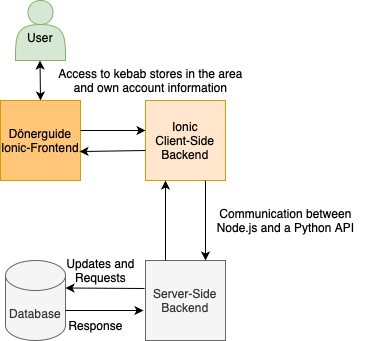
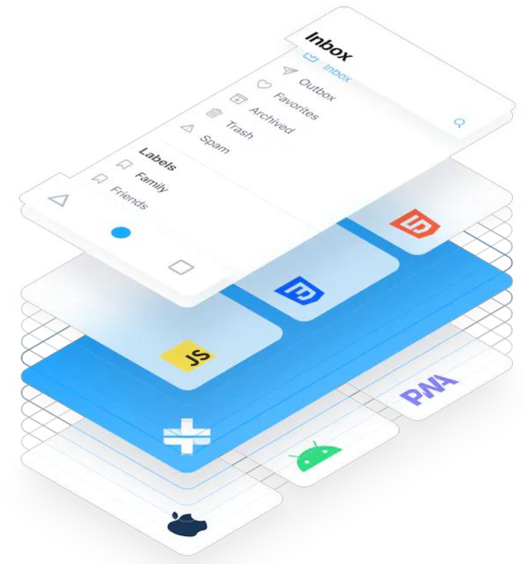

#  Dönerguide - Software Engineering Projekt

## Beschreibung

Das Projekt Doenerguide ist im Rahmen der Vorlesung "Software-Engineering" an der DHBW Stuttgart entstanden. Es handelt sich um eine Webanwendung, die es ermöglicht, Dönerläden zu bewerten und zu suchen. Zusätzlich sind Features wie ein Stempelkarten-System und eine Karte mit allen Dönerläden enthalten.


User erhalten einen umfassenden Überlick über Dönerläden in ihrer Umgebung und können anhand von den bereitgestellten Informationen entscheiden, welchen Dönerladen sie besuchen möchten.
Der Dönerladen hat so die Möglichkeit Kunden für sich zu gewinnen und kann zusätzlich durch das Stempelkarten-System Kunden an sich binden und diesen etwas zurückgeben.
Es werden somit sowohl Neukunden gewonnen als auch Bestandskunden gehalten.

Dönerguide hilft somit sowohl Kunden als auch Dönerläden und schafft eine Win-Win-Situation für beide Parteien.

### Links

#### GitHub Repository

https://github.com/doenerguide/doenerguide

#### ionic-Dokumentation

https://ionicframework.com/docs/v3/

#### DHBW Stuttgart

https://www.dhbw-stuttgart.de

## Verwendete Technologien

### Frontend

- Ionic (in Kombinaton mit Angular)

### Backend

- Node.js (Client-Side)
- Python (Server-Side)
- SQL (Datenbank)

#### Warun wurden diese Technologien gewählt?

- **Ionic**:

  - Einfache Entwicklung von mobilen Anwendungen
  - Gute Performance
  - Einfache Integration von Angular
  - Gute Dokumentation
  - Experience already gained

- **Node.js**:

  - Einfache Entwicklung von Server-Side-Code
  - Gute Performance
  - Experience already gained

- **Python**:

  - Einfache Entwicklung von Server-Side-Code
  - Gute Performance
  - Experience already gained

- **SQL**:
  - Einfache Entwicklung von Datenbanken
  - Gute Performance
  - Experience already gained

## Architektur

 

Die Architektur des Projekts ist in drei Schichten aufgeteilt. Die Präsentationsschicht, die Logikschicht und die Datenschicht.

Die Präsentationsschicht ist für die Darstellung der Daten zuständig. Hier wird die Benutzeroberfläche erstellt und die Daten dargestellt. Die Präsentationsschicht ist mit Ionic umgesetzt.

Die Logikschicht lässt sich in zwei Teile aufteilen. Zum einen die Client-Side-Logik, die in Node.js umgesetzt ist und zum anderen die Server-Side-Logik, die in Python umgesetzt ist. Die Client-Side-Logik ist für die Verarbeitung der Daten auf der Client-Seite zuständig. Die Server-Side-Logik ist für die Verarbeitung der Daten auf der Server-Seite zuständig.

Ebenso ist die Server-Side-Logik für die Kommunikation mit der Datenbank zuständig. Die Datenbank ist in SQL umgesetzt.

## Datei Struktur

Die Datei Struktur des Projekts ist wie folgt aufgebaut:

- Das Backend befindet sich im Ordner `doenerguide/backend`

Das Backend gliedert sich in 2 Bereiche.
Tests befinden sich im Ordner `doenerguide/backend/unittests`, während der eigentliche Code unter `doenerguide/backend/` zu finden ist.

- Das Frontend befindet sich im Ordner `doenerguide/doenerguide`

Die Datei Struktur des Frontends ist wie in der Ionic Dokumentation beschrieben.

## Installation

Zur Installation des Projekts müssen folgende Schritte durchgeführt werden:

1. Repository klonen

```bash
git clone https://github.com/doenerguide/doenerguide
```

2. Endpoint in den Dateien `doenerguide/doenerguide/src/environments` anpassen.

```typescript
export let environment = {
  lat: 52.520008,
  long: 13.404954,
  radius: 5,
  endpoint: "https://backend.doenerguide.envyz.de", // <-- Für die Produktion
  // endpoint: 'http://127.0.0.1:8000', <-- Zur Entwicklung
  production: true,
  shops: [],
};
```

3. Python Requirements installieren unter `doenerguide/backend/requirements.txt`

4. Node.js Requirements installieren

5. Backend starten unter `doenerguide/backend/app.py`

6. Frontend starten mit Hilfe von Ionic `ionic serve` unter `doenerguide/doenerguide`

## Backend

Das Backend ist in Python umgesetzt und ist für die Kommunikation mit der Datenbank zuständig. Es stellt die Daten für das Frontend bereit und verarbeitet die Anfragen des Frontends.

### API

Die API des Backends ist in der Datei `doenerguide/backend/app.py` definiert. Sie stellt die Endpunkte für das Frontend bereit und verarbeitet die Anfragen des Frontends.

### Datenbank

Die Datenbank ist in SQL umgesetzt und enthält die Daten für die Dönerläden und die Benutzer. Die Datenbank ist in der Datei `doenerguide/backend/database.db` definiert.

Zugriff auf die Datenbank erfolgt über die Datei `doenerguide/backend/databaseManager.py`.

## Zusätzliche Informationen

Die Dateien `doenerguide/backend/getLaeden.py` und `doenerguide/backend/createShop.py` sind für das Befüllen der Datenbank mit Dönerläden zuständig. Mit der Datei `doenerguide/backend/getLaeden.py` können zu definierten Postleitzahlen unter `doenerguide/backend/plz.txt` Dönerläden von Google Maps abgerufen werden und werden unter `doenerguide/backend/shops_url.txt` gespeichert. Mit der Datei `doenerguide/backend/createShop.py` können die Details zu den Dönerläden aus `doenerguide/backend/shops_url.txt` von Google Maps ausgelesen werden und in die Datenbank
eingefügt werden.

## Komplexes Codebeispiel

Um alle Dönerläden in einem vorgegebenen Radius aus der Datenbank aus der Datenbank abzufragen musste eine komplexe SQL-Query erstellt werden. Diese Query ist in der Datei `doenerguide/backend/databaseManager.py` zu finden.

```python
def get_shops(lat, long, radius, price_category, flags):
    conn = create_connection()
    cursor = conn.execute("""
        SELECT *
        FROM [SHOPS]
        WHERE (
            6371 * acos (
                cos ( radians(?) )
                * cos( radians( lat ) )
                * cos( radians( long ) - radians(?) )
                + sin ( radians(?) )
                * sin( radians( lat ) )
            )
        ) <= ?
        AND (priceCategory = ? OR ? = 0)
    """, (lat, long, lat, radius, price_category, price_category))

    data = cursor.fetchall()
    conn.close()
    return data
```

Dieser Python-Code definiert eine Funktion namens `get_shops`, die Daten aus einer Datenbank abruft. Die Funktion nimmt fünf Parameter: `lat, long, radius, price_category` und `flags`.

Die Funktion erstellt eine Verbindung zu einer Datenbank mit der Funktion `create_connection()`. Anschließend führt sie eine SQL-Abfrage aus, um Daten aus der Tabelle `SHOPS` zu erhalten.

Die SQL-Abfrage verwendet die Haversine-Formel, um alle Geschäfte zu finden, die sich innerhalb eines bestimmten Radius (in Kilometern) von einem gegebenen Punkt (lat, long) befinden. Die Haversine-Formel ist eine Gleichung, die die kürzeste Entfernung zwischen zwei Punkten auf der Oberfläche einer Kugel (wie der Erde) berechnet, wenn die Breiten- und Längengrade der Punkte bekannt sind.

Die Abfrage berücksichtigt auch die `price_category`. Wenn die `price_category` gleich 0 ist, werden Geschäfte aller Preiskategorien zurückgegeben. Andernfalls werden nur Geschäfte mit der angegebenen `price_category` zurückgegeben.

Die Funktion `fetchall()` wird verwendet, um alle Zeilen des Ergebnisses zu erhalten. Die Daten werden dann in einer Variablen namens data gespeichert.

Schließlich wird die Datenbankverbindung geschlossen und die Daten werden zurückgegeben.

## Frontend

Das Frontend ist gestaltet mit Hilfe von Angular. Angular ist Open-Source Typescript Framework von Google. Angular ist ein Client-seitiges Frameworkund und auf die Verwendung in dynamischer Einzelseitenanwendungen (Single Page Applications - SPAs) ausgelegt. Es basiert auf dem Model-View-Controller (MVC) Prinzip.

Die Seiten die die Anwendung verwendet werden jeweilis in den Ordner unter `doenerguide/doenerguide/src/app` definiert. Auf diesen Seiten basiert die App. Ionic wandelt die Angular Applikation in native Apps für iOS & Android um. Diese Apps laufen dann in der Laufzeitumgebung Capacitor, welche von Ionic eigens entwickelt ist.



## Retrospetive

### Positives

- Guter Fortschritt (Kernfunktionalitäten sind implementiert inkl. Alleinstellungsmerkmal)
- Richtige Wahl der Technologien (Bereits vorhandenes Wissen konnte genutzt werden und hat viel Zeit erspart)
- Feature Branches haben Entwicklungsprozess besser organisiert und beschleunigt
- Wochenaufgaben wurde gut kommuniziert und in der vorgegebenen Zeit umgesetzt

### Negatives

- Anfangs zu wenig Kommunikation und keine klaren Wochenaufgaben
- Anfangs fehlende Parallelisierung der Aufgaben in der Entwicklung

\*Keine akkuten Probleme in der Entwicklung

### Verbesserungsvorschläge

- Mehr Kommunikation

### Fazit

Eine große Aufwertung des Entwicklungsprozesses war die Einführung von Feature Branches. Diese haben den Entwicklungsprozess deutlich beschleunigt und die Organisation verbessert. Zuvor wurde von jedem Entwickler auf einem eigenen Branche entwickelt. Dies führte zu Konflikten und Problemen beim Zusammenführen der Branches. Durch die Einführung von Feature Branches konnte dies vermieden bzw. reduziert werden.
Zudem war zu jeder Zeit klar, wer an welchem Feature arbeitet.

Seitdem die Feature Branches eingeführt wurden, gab es deutlich weniger Konflikte und Probleme beim Zusammenführen der Branches und die Entwicklung verlief deutlich schneller und effizienter, da vermehrt parallel an verschiedenen Features gearbeitet werden konnte.

Verbesserungspotential besteht in der Kommunikation. Diese war zu Beginn des Projekts nicht optimal und hat sich im Laufe des Projekts verbessert. Es ist jedoch noch Luft nach oben.
So wird unteranderem nicht direkt bei den Ansprechpartnern zur passenden Technologie nachgefragt, sondern zuerst auf eigene Faust recherchiert. Dies führt zu Zeitverlust und unnötigen Problemen.

Um das zu beheben, soll in Zukunft auch verstärkt im Team an Features gearbeitet werden um bestehendes Wissen strategisch gut zu nutzen und Zeit einzusparen.

## Feedback

_zum Anzeigen des Feedback-Formulars bitte den Inhaltsblocker für disese README-Datei deaktivieren_

<iframe src="https://docs.google.com/forms/d/e/1FAIpQLSfOvTuKJbqbdxjDsQdNMjsrzHMfodnCoENHZgYpni2EZxtMVQ/viewform?embedded=true" width="640" height="566" frameborder="0" marginheight="0" marginwidth="0">Wird geladen…</iframe>

_Alternativ kann das Feedback-Formular auch unter folgendem Link aufgerufen werden: https://docs.google.com/forms/d/e/1FAIpQLSfOvTuKJbqbdxjDsQdNMjsrzHMfodnCoENHZgYpni2EZxtMVQ/viewform?usp=sf_link_

## Autoren

 </br>

- [Claudius Laur](Contact: claudius.caspar.laur@gmail.com; GitHub: `https://github.com/DrmedAllel`)
  </br></br></br>

 </br>

- [Kagan Demirer](Contact: demirerkagan0808@gmail.com; GitHub: `https://github.com/KaganDemirer`)
  </br></br></br>
