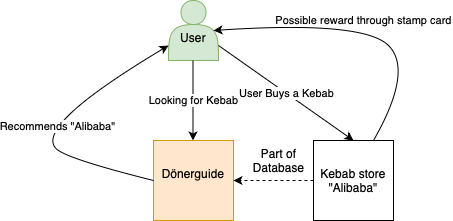

#  Dönerguide - Software Engineering Projekt

## Beschreibung

Das Projekt Doenerguide ist im Rahmen der Vorlesung "Software-Engineering" an der DHBW Stuttgart entstanden. Es handelt sich um eine Webanwendung, die es ermöglicht, Dönerläden zu bewerten und zu suchen. Zusätzlich sind Features wie ein Stempelkarten-System und eine Karte mit allen Dönerläden enthalten.

User erhalten einen umfassenden Überlick über Dönerläden in ihrer Umgebung und können anhand von den bereitgestellten Informationen entscheiden, welchen Dönerladen sie besuchen möchten.
Der Dönerladen hat so die Möglichkeit Kunden für sich zu gewinnen und kann zusätzlich durch das Stempelkarten-System Kunden an sich binden und diesen etwas zurückgeben.
Es werden somit sowohl Neukunden gewonnen als auch Bestandskunden gehalten.

Dönerguide hilft somit sowohl Kunden als auch Dönerläden und schafft eine Win-Win-Situation für beide Parteien.
### Links

#### GitHub Repository
https://github.com/doenerguide/doenerguide

#### DHBW Stuttgart
https://www.dhbw-stuttgart.de

## Verwendete Technologien

### Frontend
- Ionic

### Backend
- Node.js (Client-Side)
- Python (Server-Side)
- SQL (Datenbank)

#### Warun wurden diese Technologien gewählt?

- **Ionic**: 
  - Einfache Entwicklung von mobilen Anwendungen
  - Gute Performance
  - Einfache Integration von Angular
  - Gute Dokumentation
  - Experience already gained

- **Node.js**:
    - Einfache Entwicklung von Server-Side-Code
    - Gute Performance
    - Experience already gained

- **Python**:
    - Einfache Entwicklung von Server-Side-Code
    - Gute Performance
    - Experience already gained

- **SQL**:
    - Einfache Entwicklung von Datenbanken
    - Gute Performance
    - Experience already gained

## Architektur

## Retrospetive

### Positives

- Guter Fortschritt (Kernfunktionalitäten sind implementiert inkl. Alleinstellungsmerkmal)
- Richtige Wahl der Technologien (Bereits vorhandenes Wissen konnte genutzt werden und hat viel Zeit erspart)
- Feature Branches haben Entwicklungsprozess besser organisiert und beschleunigt
- Wochenaufgaben wurde gut kommuniziert und in der vorgegebenen Zeit umgesetzt

### Negatives
- Anfangs zu wenig Kommunikation und keine klaren Wochenaufgaben
- Anfangs fehlende Parallelisierung der Aufgaben in der Entwicklung

*Keine akkuten Probleme in der Entwicklung

### Verbesserungsvorschläge
- Mehr Kommunikation

### Fazit
Eine große Aufwertung des Entwicklungsprozesses war die Einführung von Feature Branches. Diese haben den Entwicklungsprozess deutlich beschleunigt und die Organisation verbessert. Zuvor wurde von jedem Entwickler auf einem eigenen Branche entwickelt. Dies führte zu Konflikten und Problemen beim Zusammenführen der Branches. Durch die Einführung von Feature Branches konnte dies vermieden bzw. reduziert werden.
Zudem war zu jeder Zeit klar, wer an welchem Feature arbeitet.

Seitdem die Feature Branches eingeführt wurden, gab es deutlich weniger Konflikte und Probleme beim Zusammenführen der Branches und die Entwicklung verlief deutlich schneller und effizienter, da vermehrt parallel an verschiedenen Features gearbeitet werden konnte.

Verbesserungspotential besteht in der Kommunikation. Diese war zu Beginn des Projekts nicht optimal und hat sich im Laufe des Projekts verbessert. Es ist jedoch noch Luft nach oben.
So wird unteranderem nicht direkt bei den Ansprechpartnern zur passenden Technologie nachgefragt, sondern zuerst auf eigene Faust recherchiert. Dies führt zu Zeitverlust und unnötigen Problemen.

Um das zu beheben, soll in Zukunft auch verstärkt im Team an Features gearbeitet werden um bestehendes Wissen strategisch gut zu nutzen und Zeit einzusparen.